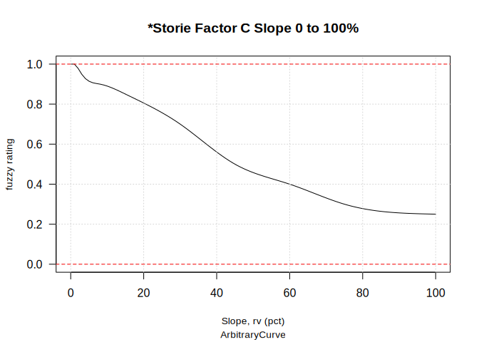
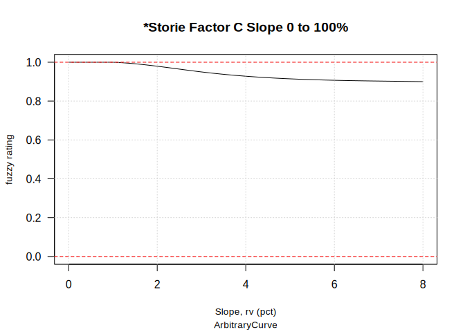
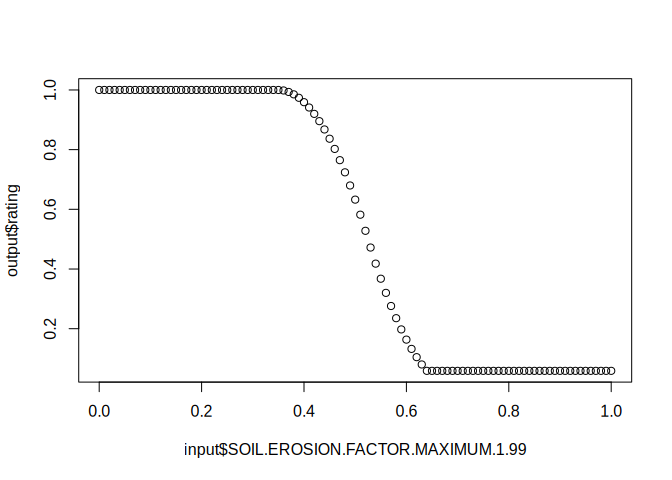

<!-- badges: start -->

<!-- badges: end -->

# {InterpretationEngine} (alpha) R package

To install the alpha version of the “interpretation engine” R package
use {remotes} to get the latest version from GitHub. This will install
all dependencies.

    # install package from ncss-tech interpretation-engine repository                   
    remotes::install_github('ncss-tech/interpretation-engine')

# Interpretations Outside of NASIS

There are many reasons for wanting to develop, test, and apply
interpretations to soil data outside the context of NASIS. This project
aims to create a prototype from existing interpretation rules,
evaluations, and properties as managed in NASIS. Once the prototype is
complete it should be possible to generate fuzzy ratings from arbitrary
sources of soil and environmental data sources.

## How Does it Work?

The
[data.tree](https://cran.r-project.org/web/packages/data.tree/vignettes/data.tree.html)
package defines objects and methods that are well suited to the task of
describing the hierarchy of rules and evaluations. NASIS evaluations
utilize definitions of shape functions and cubic splines, which are
further interpolated using `approxfun()` and `splinefun()`. NASIS hedges
and operators perform arithmetic operations on numeric matrices to
facilitate combining multiple properties and evaluations into rules.

## Outline

1.  Load all rules, evaluations, properties into R via ODBC as
    `data.frame` objects
2.  Load single rule and (recursively) load sub-rules into a `data.tree`
    object
3.  Load evaluation functions into each terminal node of `data.tree`
    object
4.  Load hedge and operator functions into each decision node of
    `data.tree` object
5.  Use wrapper function (`interpret()`) to:
    -   Send properties to evaluation functions
    -   Combine fuzzy values via operators and hedges to generate a
        final fuzzy rating

## Examples

    library(InterpretationEngine)

### Evaluation Curves

The following images show the output of an evaluation function for slope
(`"*Storie Factor C Slope 0 to 100%"`) in NASIS.

    eval <- subset(NASIS_evaluations, evalname == "*Storie Factor C Slope 0 to 100%")
    plotEvaluation(eval, xlim = c(0, 100))

    # zoom in on  custom shape in [0, 8]% slope range
    plotEvaluation(eval, xlim = c(0,8))

### Rule Trees

The following examples generate data.frame representation of the
`data.tree` objects in terms of an input property list, and the
hierarchy of rules, operators, hedges, evaluations and properties that
define a “primary rule” or interpretation.

**Dust PM10 and PM2.5 Generation**

    # use initRuleset() to parse a rule by name
    r <- initRuleset("Dust PM10 and PM2.5 Generation")

    # view input properties
    getPropertySet(r)

    ##                                              evaluation
    ## 1                                Dryness Index 0.5 to 3
    ## 2              Dust from Gypsum Content 2 to 15 Percent
    ## 3 Dust from Silt and Clay Content 20 to 70 Percent Sand
    ##                                                 propname propiid
    ## 1                                          DRYNESS INDEX   15302
    ## 2             WTD_AVG GYPSUM 0-50cm OR ABOVE RESTRICTION   15300
    ## 3 WTD_AVG SAND CONTENT 0-50cm OR ABOVE RESTRICTION, NO O   15301

    # view rule tree
    data.tree::ToDataFrameTree(r, "Type", "Value", "RefId", "rule_refid")

    ##                                                                        levelName
    ## 1  Dust PM10 and PM2.5 Generation                                               
    ## 2   °--RuleHedge_de473ab5                                                       
    ## 3       °--RuleOperator_0a397761                                                
    ## 4           ¦--Dryness Index 0.5 to 3                                           
    ## 5           °--RuleOperator_7025ab26                                            
    ## 6               ¦--Dust Due to Gypsum                                           
    ## 7               ¦   °--RuleHedge_5c18cb73                                       
    ## 8               ¦       °--Dust from Gypsum Content 2 to 15 Percent             
    ## 9               °--Dust Due to Silt and Clay                                    
    ## 10                  °--RuleHedge_caf7e2e0                                       
    ## 11                      °--Dust from Silt and Clay Content 20 to 70 Percent Sand
    ##              Type Value RefId rule_refid
    ## 1            <NA>  <NA>  <NA>       <NA>
    ## 2        multiply   0.5  <NA>       <NA>
    ## 3         product  <NA>  <NA>       <NA>
    ## 4            <NA>  <NA> 18448       <NA>
    ## 5             sum  <NA>  <NA>       <NA>
    ## 6            <NA>  <NA> 23659      23659
    ## 7    not_null_and     0  <NA>       <NA>
    ## 8            <NA>  <NA> 18446       <NA>
    ## 9            <NA>  <NA> 23661      23661
    ## 10 null_not_rated     0  <NA>       <NA>
    ## 11           <NA>  <NA> 18447       <NA>

**California Storie Index**

Using the `data.tree` representation of the California Storie Index
primary rule, we can extract the entire set of evaluations and required
properties:

    r <- initRuleset("AGR - California Revised Storie Index (CA)")

    # view input properties
    getPropertySet(r)

    ##                                                      evaluation
    ## 1           *Storie Factor A Pedon Group not rated taxonomy rev
    ## 2               *Storie Factor A Pedon Group 1 and 2 soil depth
    ## 6                      *Storie Factor A Pedon Group 1 suborders
    ## 7                   *Storie Factor A Pedon Group 1 great groups
    ## 8                      *Storie Factor A Pedon Group 1 subgroups
    ## 9                 *Storie Factor A Pedon Group 7, 8, 9 landform
    ## 58  *Storie Factor A Pedon Group 2 suborders Arents and Cambids
    ## 59                  *Storie Factor A Pedon Group 2 great groups
    ## 60                  *Storie Factor A Pedon Group 3 great groups
    ## 61                *Storie Factor A Pedon Group 4/6 great groups
    ## 65                    *Storie featkind = abrupt textural change
    ## 69             Component restriction = "abrupt textural change"
    ## 73                    *Storie Factor A Pedon Group 3 soil depth
    ## 74                    *Storie Factor A Pedon Group 5 soil depth
    ## 75                        *Storie Factor A Pedon Group 5 durids
    ## 76                  *Storie Factor A Pedon Group 5 great groups
    ## 77                     *Storie Factor A Pedon Group 5 subgroups
    ## 78  *Storie Factor A Pedon Group 4/6 depth abrupt text featkind
    ## 79    *Storie Factor A Pedon Group 4/6 depth abrupt tex reskind
    ## 80              *Storie Factor A Pedon Group 7 and 8 soil depth
    ## 81                    *Storie Factor A Pedon Group 9 soil depth
    ## 82                             *Storie Factor B Surface Texture
    ## 83                    *Storie Factor B rock frag volume 0-25 cm
    ## 84                             *Storie Factor C Slope 0 to 100%
    ## 85                 *Storie Factor X Toxicity EC maximum 0-25 cm
    ## 86                *Storie Factor X Toxicity SAR maximum 0-25 cm
    ## 87                 *Storie Factor X Toxicity pH minimum 0-25 cm
    ## 88                 *Storie Factor X Toxicity pH maximum 0-25 cm
    ## 89                 *Storie Factor X drainage class = moderately
    ## 90                   *Storie component local phase is *drained*
    ## 99         *Storie component local phase is *partially drained*
    ## 108           *Storie Factor X drainage class = somewhat poorly
    ## 109       *Storie Factor X drainage class = poor or very poorly
    ## 110                      *Storie Factor X drainage class = well
    ## 111           *Storie Factor X drainage class = all excessively
    ## 112        *Storie Factor X landscape ponding in growing season
    ## 113                                   Landscape Flooding "NONE"
    ## 114       *Storie Factor X landscape flooding in growing season
    ## 115                          *Storie Factor X erosion class = 1
    ## 119                          *Storie Factor X erosion class = 2
    ## 123                          *Storie Factor X erosion class = 3
    ## 127                          *Storie Factor X erosion class = 4
    ## 131                          *Storie Factor X erosion class = 0
    ## 135    *Storie Factor X landscape wetness, grow. season, 25-100
    ## 136                         *Storie Factor X temperature regime
    ##                                                         propname propiid
    ## 1                                                TAXONOMIC ORDER      85
    ## 2       *Storie depth to first restriction for Profile Group 1-3   12184
    ## 6                                             TAXONOMIC SUBORDER      87
    ## 7                                          TAXONOMIC GREAT GROUP      83
    ## 8                                             TAXONOMIC SUBGROUP      86
    ## 9         *Storie landforms in hills and mountains of California   12170
    ## 58                                            TAXONOMIC SUBORDER      87
    ## 59                                         TAXONOMIC GREAT GROUP      83
    ## 60                                         TAXONOMIC GREAT GROUP      83
    ## 61                                         TAXONOMIC GREAT GROUP      83
    ## 65   *Storie where at least one cdfkind = abrupt textural change   12315
    ## 69                                        Component restrictions   11293
    ## 73      *Storie depth to first restriction for Profile Group 1-3   12184
    ## 74                      *Storie depth to pan for Profile Group 5   12164
    ## 75                                            TAXONOMIC SUBORDER      87
    ## 76                                         TAXONOMIC GREAT GROUP      83
    ## 77                                            TAXONOMIC SUBGROUP      86
    ## 78  *Storie depth to featknd abrupt tex change Profile Group 4/6   12376
    ## 79    *Storie depth to reskind abrupt tex change Profile Grp 4/6   12375
    ## 80    *Storie depth to hard bedrock/petro* for Profile Grp 7/8/9   12168
    ## 81  *Storie depth to soft bedrock or densics for Profile Grp 7-9   12186
    ## 82              *Storie texture score - first horizon below duff   42006
    ## 83              ROCK FRAG VOLUME IN DEPTH 0-25 cm OR RESTRICTION   42009
    ## 84                                                     Slope, rv   12042
    ## 85                        EC MAXIMUM IN DEPTH 0-25 CM BELOW DUFF   42002
    ## 86                       SAR MAXIMUM IN DEPTH 0-25 CM BELOW DUFF   42003
    ## 87                        pH MINIMUM IN DEPTH 0-25 CM BELOW DUFF   42000
    ## 88                        pH MAXIMUM IN DEPTH 0-25 CM BELOW DUFF   42001
    ## 89                                            GRL-DRAINAGE CLASS   10345
    ## 90                     **Storie component local phase is drained   12335
    ## 99           **Storie component local phase is partially drained   12334
    ## 108                                           GRL-DRAINAGE CLASS   10345
    ## 109                                           GRL-DRAINAGE CLASS   10345
    ## 110                                           GRL-DRAINAGE CLASS   10345
    ## 111                                           GRL-DRAINAGE CLASS   10345
    ## 112            *Storie ponding interaction max in growing season   12329
    ## 113                       FLOODING FREQUENCY (Maximum Frequency)      28
    ## 114           *Storie flooding interaction max in growing season   12189
    ## 115                             Erosion Class in component table   12377
    ## 119                             Erosion Class in component table   12377
    ## 123                             Erosion Class in component table   12377
    ## 127                             Erosion Class in component table   12377
    ## 131                             Erosion Class in component table   12377
    ## 135      *Storie near surface wetness rv depth in growing season   12584
    ## 136                             *Storie temperature regime score   42014

    # view rule tree
    data.tree::ToDataFrameTree(r, "Type", "Value", "RefId", "rule_refid")

    ##                                                                                               levelName
    ## 1   AGR - California Revised Storie Index (CA)                                                         
    ## 2    °--RuleOperator_31a1eb65                                                                          
    ## 3        ¦--*Storie Factor A Not Rated Soil Orders rev                                                 
    ## 4        ¦   °--RuleHedge_1193d3c1                                                                     
    ## 5        ¦       °--*Storie Factor A Pedon Group not rated taxonomy rev                                
    ## 6        ¦--*Storie Factor A                                                                           
    ## 7        ¦   °--RuleOperator_01948bb8                                                                  
    ## 8        ¦       ¦--*Storie Factor A Profile Group 1 rev                                               
    ## 9        ¦       ¦   °--RuleOperator_a72ba798                                                          
    ## 10       ¦       ¦       ¦--RuleOperator_b267bf8e                                                      
    ## 11       ¦       ¦       ¦   ¦--*Storie Factor A Profile Group 1 and 2 fuzzy depth                     
    ## 12       ¦       ¦       ¦   ¦   °--RuleHedge_7fad1a79                                                 
    ## 13       ¦       ¦       ¦   ¦       °--*Storie Factor A Pedon Group 1 and 2 soil depth                
    ## 14       ¦       ¦       ¦   °--*Storie Factor A Profile Group 1 taxonomy rev                          
    ## 15       ¦       ¦       ¦       °--RuleOperator_4d1fdd8f                                              
    ## 16       ¦       ¦       ¦           ¦--RuleHedge_44b2d8f3                                             
    ## 17       ¦       ¦       ¦           ¦   °--*Storie Factor A Pedon Group 1 suborders                   
    ## 18       ¦       ¦       ¦           ¦--RuleHedge_f2a5b4ba                                             
    ## 19       ¦       ¦       ¦           ¦   °--*Storie Factor A Pedon Group 1 great groups                
    ## 20       ¦       ¦       ¦           °--RuleHedge_25e606a5                                             
    ## 21       ¦       ¦       ¦               °--*Storie Factor A Pedon Group 1 subgroups                   
    ## 22       ¦       ¦       °--RuleHedge_ea4b1839                                                         
    ## 23       ¦       ¦           °--*Storie Factor A Profile Group 7,8,9 landform                          
    ## 24       ¦       ¦               °--RuleHedge_608f03c8                                                 
    ## 25       ¦       ¦                   °--*Storie Factor A Pedon Group 7, 8, 9 landform                  
    ## 26       ¦       ¦--*Storie Factor A Profile Group 2 rev                                               
    ## 27       ¦       ¦   °--RuleOperator_8a20de79                                                          
    ## 28       ¦       ¦       ¦--RuleOperator_71911310                                                      
    ## 29       ¦       ¦       ¦   ¦--*Storie Factor A Profile Group 1 and 2 fuzzy depth                     
    ## 30       ¦       ¦       ¦   ¦   °--RuleHedge_7fad1a79                                                 
    ## 31       ¦       ¦       ¦   ¦       °--*Storie Factor A Pedon Group 1 and 2 soil depth                
    ## 32       ¦       ¦       ¦   °--*Storie Factor A Profile Group 2 taxonomy                              
    ## 33       ¦       ¦       ¦       °--RuleOperator_0ad34d47                                              
    ## 34       ¦       ¦       ¦           ¦--RuleHedge_698c3a67                                             
    ## 35       ¦       ¦       ¦           ¦   °--*Storie Factor A Pedon Group 2 suborders Arents and Cambids
    ## 36       ¦       ¦       ¦           °--RuleHedge_8fbcb397                                             
    ## 37       ¦       ¦       ¦               °--*Storie Factor A Pedon Group 2 great groups                
    ## 38       ¦       ¦       °--RuleHedge_ea4b1839                                                         
    ## 39       ¦       ¦           °--*Storie Factor A Profile Group 7,8,9 landform                          
    ## 40       ¦       ¦               °--RuleHedge_608f03c8                                                 
    ## 41       ¦       ¦                   °--*Storie Factor A Pedon Group 7, 8, 9 landform                  
    ## 42       ¦       ¦--*Storie Factor A Profile Group 3                                                   
    ## 43       ¦       ¦   °--RuleOperator_a84c18cd                                                          
    ## 44       ¦       ¦       ¦--*Storie Factor A Profile Group 3 taxonomy                                  
    ## 45       ¦       ¦       ¦   °--RuleOperator_c859411b                                                  
    ## 46       ¦       ¦       ¦       ¦--RuleHedge_a14e5a0e                                                 
    ## 47       ¦       ¦       ¦       ¦   °--*Storie Factor A Pedon Group 3 great groups                    
    ## 48       ¦       ¦       ¦       °--RuleOperator_15a86db4                                              
    ## 49       ¦       ¦       ¦           ¦--RuleHedge_da245a09                                             
    ## 50       ¦       ¦       ¦           ¦   °--*Storie Factor A Pedon Group 4/6 great groups              
    ## 51       ¦       ¦       ¦           ¦--RuleHedge_61008193                                             
    ## 52       ¦       ¦       ¦           ¦   °--RuleHedge_1a2fddac                                         
    ## 53       ¦       ¦       ¦           ¦       °--*Storie featkind = abrupt textural change              
    ## 54       ¦       ¦       ¦           °--RuleHedge_214d73a9                                             
    ## 55       ¦       ¦       ¦               °--RuleHedge_137ed382                                         
    ## 56       ¦       ¦       ¦                   °--Component restriction = "abrupt textural change"       
    ## 57       ¦       ¦       °--*Storie Factor A Profile Group 3 fuzzy depth                               
    ## 58       ¦       ¦           °--RuleHedge_725c57d0                                                     
    ## 59       ¦       ¦               °--*Storie Factor A Pedon Group 3 soil depth                          
    ## 60       ¦       ¦--*Storie Factor A Profile Group 5                                                   
    ## 61       ¦       ¦   °--RuleOperator_38a12238                                                          
    ## 62       ¦       ¦       ¦--RuleOperator_1ffc51b2                                                      
    ## 63       ¦       ¦       ¦   ¦--*Storie Factor A Profile Group 5 fuzzy depth                           
    ## 64       ¦       ¦       ¦   ¦   °--RuleHedge_a4df1747                                                 
    ## 65       ¦       ¦       ¦   ¦       °--*Storie Factor A Pedon Group 5 soil depth                      
    ## 66       ¦       ¦       ¦   °--*Storie Factor A Profile Group 5 taxonomy                              
    ## 67       ¦       ¦       ¦       °--RuleOperator_d8ea2331                                              
    ## 68       ¦       ¦       ¦           ¦--RuleHedge_aba67333                                             
    ## 69       ¦       ¦       ¦           ¦   °--*Storie Factor A Pedon Group 5 durids                      
    ## 70       ¦       ¦       ¦           ¦--RuleHedge_a831076b                                             
    ## 71       ¦       ¦       ¦           ¦   °--*Storie Factor A Pedon Group 5 great groups                
    ## 72       ¦       ¦       ¦           °--RuleHedge_7954eb2b                                             
    ## 73       ¦       ¦       ¦               °--*Storie Factor A Pedon Group 5 subgroups                   
    ## 74       ¦       ¦       °--RuleHedge_ea4b1839                                                         
    ## 75       ¦       ¦           °--*Storie Factor A Profile Group 7,8,9 landform                          
    ## 76       ¦       ¦               °--RuleHedge_608f03c8                                                 
    ## 77       ¦       ¦                   °--*Storie Factor A Pedon Group 7, 8, 9 landform                  
    ## 78       ¦       ¦--*Storie Factor A Profile Group 4/6                                                 
    ## 79       ¦       ¦   °--RuleOperator_867650f1                                                          
    ## 80       ¦       ¦       ¦--*Storie Factor A Profile Group 4/6 fuzzy depth                             
    ## 81       ¦       ¦       ¦   °--RuleOperator_804837c6                                                  
    ## 82       ¦       ¦       ¦       ¦--RuleHedge_74ec3ef6                                                 
    ## 83       ¦       ¦       ¦       ¦   °--*Storie Factor A Pedon Group 4/6 depth abrupt text featkind    
    ## 84       ¦       ¦       ¦       °--RuleHedge_5d562f5b                                                 
    ## 85       ¦       ¦       ¦           °--*Storie Factor A Pedon Group 4/6 depth abrupt tex reskind      
    ## 86       ¦       ¦       °--*Storie Factor A Profile Group 4/6 taxonomy w/ abrupt text                 
    ## 87       ¦       ¦           °--RuleOperator_d7eb1bf2                                                  
    ## 88       ¦       ¦               ¦--*Storie Factor A Pedon Group 4/6 great groups                      
    ## 89       ¦       ¦               °--RuleOperator_55f9f74b                                              
    ## 90       ¦       ¦                   ¦--*Storie featkind = abrupt textural change                      
    ## 91       ¦       ¦                   °--Component restriction = "abrupt textural change"               
    ## 92       ¦       °--*Storie Factor A Profile Groups 7, 8 or 9                                          
    ## 93       ¦           °--RuleOperator_e9966d4d                                                          
    ## 94       ¦               ¦--RuleOperator_48460ff8                                                      
    ## 95       ¦               ¦   ¦--*Storie Factor A Profile Group 7,8,9 landform                          
    ## 96       ¦               ¦   ¦   °--RuleHedge_608f03c8                                                 
    ## 97       ¦               ¦   ¦       °--*Storie Factor A Pedon Group 7, 8, 9 landform                  
    ## 98       ¦               ¦   °--*Storie Factor A Profile Groups 7, 8, 9 fuzzy depth (hard)             
    ## 99       ¦               ¦       °--RuleHedge_62ac73b3                                                 
    ## 100      ¦               ¦           °--*Storie Factor A Pedon Group 7 and 8 soil depth                
    ## 101      ¦               °--RuleOperator_9ffcd0a2                                                      
    ## 102      ¦                   ¦--*Storie Factor A Profile Group 7,8,9 landform                          
    ## 103      ¦                   ¦   °--RuleHedge_608f03c8                                                 
    ## 104      ¦                   ¦       °--*Storie Factor A Pedon Group 7, 8, 9 landform                  
    ## 105      ¦                   °--*Storie Factor A Profile Group 7, 8 and 9 fuzzy depth (soft)           
    ## 106      ¦                       °--RuleHedge_c0fd8926                                                 
    ## 107      ¦                           °--*Storie Factor A Pedon Group 9 soil depth                      
    ## 108      ¦--*Storie Factor B rev                                                                       
    ## 109      ¦   °--RuleOperator_21467f0e                                                                  
    ## 110      ¦       ¦--*Storie Factor B surface texture rev                                               
    ## 111      ¦       ¦   °--RuleHedge_14c104e8                                                             
    ## 112      ¦       ¦       °--*Storie Factor B Surface Texture                                           
    ## 113      ¦       °--*Storie Factor B surface rock fragments rev                                        
    ## 114      ¦           °--*Storie Factor B rock frag volume 0-25 cm                                      
    ## 115      ¦--*Storie Factor C Slope fuzzy                                                               
    ## 116      ¦   °--RuleHedge_d4054451                                                                     
    ## 117      ¦       °--*Storie Factor C Slope 0 to 100%                                                   
    ## 118      ¦--*Storie Factor X (all chemistry) rev                                                       
    ## 119      ¦   °--RuleOperator_12d91bc8                                                                  
    ## 120      ¦       ¦--*Storie Factor X (toxicity EC) rev                                                 
    ## 121      ¦       ¦   °--RuleHedge_7334ea83                                                             
    ## 122      ¦       ¦       °--*Storie Factor X Toxicity EC maximum 0-25 cm                               
    ## 123      ¦       ¦--*Storie Factor X (toxicity SAR) rev                                                
    ## 124      ¦       ¦   °--RuleHedge_70d0ed1f                                                             
    ## 125      ¦       ¦       °--*Storie Factor X Toxicity SAR maximum 0-25 cm                              
    ## 126      ¦       °--*Storie Factor X (toxicity pH) rev                                                 
    ## 127      ¦           °--RuleHedge_dea55415                                                             
    ## 128      ¦               °--RuleOperator_37d7e82f                                                      
    ## 129      ¦                   ¦--*Storie Factor X Toxicity pH minimum 0-25 cm                           
    ## 130      ¦                   °--*Storie Factor X Toxicity pH maximum 0-25 cm                           
    ## 131      ¦--*Storie Factor X (all hydrologic and erosion features)                                     
    ## 132      ¦   °--RuleOperator_e5feb45e                                                                  
    ## 133      ¦       ¦--*Storie Factor X (drainage class)                                                  
    ## 134      ¦       ¦   °--RuleOperator_3be6bd57                                                          
    ## 135      ¦       ¦       ¦--RuleOperator_fb03758e                                                      
    ## 136      ¦       ¦       ¦   ¦--RuleHedge_773dd408                                                     
    ## 137      ¦       ¦       ¦   ¦   °--*Storie Factor X drainage = moderately well                        
    ## 138      ¦       ¦       ¦   ¦       °--RuleHedge_cacbefaa                                             
    ## 139      ¦       ¦       ¦   ¦           °--*Storie Factor X drainage class = moderately               
    ## 140      ¦       ¦       ¦   °--RuleOperator_bff68afb                                                  
    ## 141      ¦       ¦       ¦       ¦--RuleHedge_60689286                                                 
    ## 142      ¦       ¦       ¦       ¦   °--*Storie Factor X local phase is "drained"                      
    ## 143      ¦       ¦       ¦       ¦       °--RuleHedge_be509db7                                         
    ## 144      ¦       ¦       ¦       ¦           °--*Storie component local phase is *drained*             
    ## 145      ¦       ¦       ¦       °--RuleHedge_9acf6418                                                 
    ## 146      ¦       ¦       ¦           °--*Storie Factor X local phase is "partially drained"            
    ## 147      ¦       ¦       ¦               °--RuleHedge_a792a01a                                         
    ## 148      ¦       ¦       ¦                   °--*Storie component local phase is *partially drained*   
    ## 149      ¦       ¦       ¦--RuleOperator_b07fd13d                                                      
    ## 150      ¦       ¦       ¦   ¦--RuleHedge_4f74ec66                                                     
    ## 151      ¦       ¦       ¦   ¦   °--*Storie Factor X drainage = somewhat poorly                        
    ## 152      ¦       ¦       ¦   ¦       °--RuleHedge_72e64559                                             
    ## 153      ¦       ¦       ¦   ¦           °--*Storie Factor X drainage class = somewhat poorly          
    ## 154      ¦       ¦       ¦   °--RuleOperator_fac62418                                                  
    ## 155      ¦       ¦       ¦       ¦--RuleHedge_7c3c6ede                                                 
    ## 156      ¦       ¦       ¦       ¦   °--*Storie Factor X local phase is "drained"                      
    ## 157      ¦       ¦       ¦       ¦       °--RuleHedge_be509db7                                         
    ## 158      ¦       ¦       ¦       ¦           °--*Storie component local phase is *drained*             
    ## 159      ¦       ¦       ¦       °--RuleHedge_b1c9b07e                                                 
    ## 160      ¦       ¦       ¦           °--*Storie Factor X local phase is "partially drained"            
    ## 161      ¦       ¦       ¦               °--RuleHedge_a792a01a                                         
    ## 162      ¦       ¦       ¦                   °--*Storie component local phase is *partially drained*   
    ## 163      ¦       ¦       ¦--RuleOperator_f2cb68fb                                                      
    ## 164      ¦       ¦       ¦   ¦--RuleHedge_80a214a1                                                     
    ## 165      ¦       ¦       ¦   ¦   °--RuleHedge_f60f0b26                                                 
    ## 166      ¦       ¦       ¦   ¦       °--*Storie Factor X drainage = poorly or very poorly              
    ## 167      ¦       ¦       ¦   ¦           °--RuleHedge_9edb6995                                         
    ## 168      ¦       ¦       ¦   ¦               °--*Storie Factor X drainage class = poor or very poorly  
    ## 169      ¦       ¦       ¦   °--RuleOperator_799a4c22                                                  
    ## 170      ¦       ¦       ¦       ¦--RuleHedge_711817c6                                                 
    ## 171      ¦       ¦       ¦       ¦   °--*Storie Factor X local phase is "drained"                      
    ## 172      ¦       ¦       ¦       ¦       °--RuleHedge_be509db7                                         
    ## 173      ¦       ¦       ¦       ¦           °--*Storie component local phase is *drained*             
    ## 174      ¦       ¦       ¦       °--RuleHedge_b1c9b07e                                                 
    ## 175      ¦       ¦       ¦           °--*Storie Factor X local phase is "partially drained"            
    ## 176      ¦       ¦       ¦               °--RuleHedge_a792a01a                                         
    ## 177      ¦       ¦       ¦                   °--*Storie component local phase is *partially drained*   
    ## 178      ¦       ¦       ¦--*Storie Factor X drainage = well drained                                   
    ## 179      ¦       ¦       ¦   °--RuleHedge_80e2e2c3                                                     
    ## 180      ¦       ¦       ¦       °--*Storie Factor X drainage class = well                             
    ## 181      ¦       ¦       °--RuleHedge_c0debf92                                                         
    ## 182      ¦       ¦           °--*Storie Factor X drainage = all excessively                            
    ## 183      ¦       ¦               °--RuleHedge_2347996a                                                 
    ## 184      ¦       ¦                   °--*Storie Factor X drainage class = all excessively              
    ## 185      ¦       ¦--*Storie Factor X (flooding and ponding)                                            
    ## 186      ¦       ¦   °--RuleOperator_dae2aeb4                                                          
    ## 187      ¦       ¦       ¦--*Storie Factor X (ponding interaction)                                     
    ## 188      ¦       ¦       ¦   °--*Storie Factor X landscape ponding in growing season                   
    ## 189      ¦       ¦       °--*Storie Factor X (flooding interaction)                                    
    ## 190      ¦       ¦           °--RuleOperator_fe6380a3                                                  
    ## 191      ¦       ¦               ¦--Landscape Flooding "NONE"                                          
    ## 192      ¦       ¦               °--*Storie Factor X landscape flooding in growing season              
    ## 193      ¦       ¦--*Storie Factor X (erosion)                                                         
    ## 194      ¦       ¦   °--RuleOperator_435f004a                                                          
    ## 195      ¦       ¦       ¦--*Storie Factor X (erosion in uplands)                                      
    ## 196      ¦       ¦       ¦   °--RuleOperator_2be43cb6                                                  
    ## 197      ¦       ¦       ¦       ¦--*Storie Factor A Profile Group 7,8,9 landform                      
    ## 198      ¦       ¦       ¦       ¦   °--RuleHedge_608f03c8                                             
    ## 199      ¦       ¦       ¦       ¦       °--*Storie Factor A Pedon Group 7, 8, 9 landform              
    ## 200      ¦       ¦       ¦       °--*Storie Factor X (erosion class)                                   
    ## 201      ¦       ¦       ¦           °--RuleOperator_3ecc937e                                          
    ## 202      ¦       ¦       ¦               ¦--RuleHedge_d47e12df                                         
    ## 203      ¦       ¦       ¦               ¦   °--*Storie Factor X erosion class = 1                     
    ## 204      ¦       ¦       ¦               ¦       °--RuleHedge_be73ca0c                                 
    ## 205      ¦       ¦       ¦               ¦           °--*Storie Factor X erosion class = 1             
    ## 206      ¦       ¦       ¦               ¦--RuleHedge_62c7497e                                         
    ## 207      ¦       ¦       ¦               ¦   °--*Storie Factor X erosion class = 2                     
    ## 208      ¦       ¦       ¦               ¦       °--RuleHedge_5c67fdf4                                 
    ## 209      ¦       ¦       ¦               ¦           °--*Storie Factor X erosion class = 2             
    ## 210      ¦       ¦       ¦               ¦--RuleHedge_16378273                                         
    ## 211      ¦       ¦       ¦               ¦   °--*Storie Factor X erosion class = 3                     
    ## 212      ¦       ¦       ¦               ¦       °--RuleHedge_c65bf0da                                 
    ## 213      ¦       ¦       ¦               ¦           °--*Storie Factor X erosion class = 3             
    ## 214      ¦       ¦       ¦               ¦--RuleHedge_68a3b3e6                                         
    ## 215      ¦       ¦       ¦               ¦   °--*Storie Factor X erosion class = 4                     
    ## 216      ¦       ¦       ¦               ¦       °--RuleHedge_772054de                                 
    ## 217      ¦       ¦       ¦               ¦           °--*Storie Factor X erosion class = 4             
    ## 218      ¦       ¦       ¦               °--*Storie Factor X erosion class = 0                         
    ## 219      ¦       ¦       ¦                   °--RuleHedge_b3c4b963                                     
    ## 220      ¦       ¦       ¦                       °--*Storie Factor X erosion class = 0                 
    ## 221      ¦       ¦       °--*Storie Factor X (erosion in valley)                                       
    ## 222      ¦       ¦           °--RuleOperator_9fee9122                                                  
    ## 223      ¦       ¦               ¦--*Storie Factor X (erosion class)                                   
    ## 224      ¦       ¦               ¦   °--RuleOperator_3ecc937e                                          
    ## 225      ¦       ¦               ¦       ¦--RuleHedge_d47e12df                                         
    ## 226      ¦       ¦               ¦       ¦   °--*Storie Factor X erosion class = 1                     
    ## 227      ¦       ¦               ¦       ¦       °--RuleHedge_be73ca0c                                 
    ## 228      ¦       ¦               ¦       ¦           °--*Storie Factor X erosion class = 1             
    ## 229      ¦       ¦               ¦       ¦--RuleHedge_62c7497e                                         
    ## 230      ¦       ¦               ¦       ¦   °--*Storie Factor X erosion class = 2                     
    ## 231      ¦       ¦               ¦       ¦       °--RuleHedge_5c67fdf4                                 
    ## 232      ¦       ¦               ¦       ¦           °--*Storie Factor X erosion class = 2             
    ## 233      ¦       ¦               ¦       ¦--RuleHedge_16378273                                         
    ## 234      ¦       ¦               ¦       ¦   °--*Storie Factor X erosion class = 3                     
    ## 235      ¦       ¦               ¦       ¦       °--RuleHedge_c65bf0da                                 
    ## 236      ¦       ¦               ¦       ¦           °--*Storie Factor X erosion class = 3             
    ## 237      ¦       ¦               ¦       ¦--RuleHedge_68a3b3e6                                         
    ## 238      ¦       ¦               ¦       ¦   °--*Storie Factor X erosion class = 4                     
    ## 239      ¦       ¦               ¦       ¦       °--RuleHedge_772054de                                 
    ## 240      ¦       ¦               ¦       ¦           °--*Storie Factor X erosion class = 4             
    ## 241      ¦       ¦               ¦       °--*Storie Factor X erosion class = 0                         
    ## 242      ¦       ¦               ¦           °--RuleHedge_b3c4b963                                     
    ## 243      ¦       ¦               ¦               °--*Storie Factor X erosion class = 0                 
    ## 244      ¦       ¦               °--RuleHedge_ea4b1839                                                 
    ## 245      ¦       ¦                   °--*Storie Factor A Profile Group 7,8,9 landform                  
    ## 246      ¦       ¦                       °--RuleHedge_608f03c8                                         
    ## 247      ¦       ¦                           °--*Storie Factor A Pedon Group 7, 8, 9 landform          
    ## 248      ¦       °--*Storie Factor X (wetness in growing season, 25-100cm)                             
    ## 249      ¦           °--RuleHedge_7981f6f4                                                             
    ## 250      ¦               °--*Storie Factor X landscape wetness, grow. season, 25-100                   
    ## 251      °--*Storie Factor X (temperature regime)                                                      
    ## 252          °--*Storie Factor X temperature regime                                                    
    ##               Type Value RefId rule_refid
    ## 1             <NA>  <NA>  <NA>       <NA>
    ## 2          product  <NA>  <NA>       <NA>
    ## 3             <NA>  <NA> 49446      49446
    ## 4          null_or     0  <NA>       <NA>
    ## 5             <NA>  <NA> 50481       <NA>
    ## 6             <NA>  <NA> 15976      15976
    ## 7               or  <NA>  <NA>       <NA>
    ## 8             <NA>  <NA> 49448      49448
    ## 9              and  <NA>  <NA>       <NA>
    ## 10           times  <NA>  <NA>       <NA>
    ## 11            <NA>  <NA> 15967      15967
    ## 12    not_null_and     0  <NA>       <NA>
    ## 13            <NA>  <NA> 12916       <NA>
    ## 14            <NA>  <NA> 49447      49447
    ## 15              or  <NA>  <NA>       <NA>
    ## 16    not_null_and     0  <NA>       <NA>
    ## 17            <NA>  <NA> 12914       <NA>
    ## 18    not_null_and     0  <NA>       <NA>
    ## 19            <NA>  <NA> 12915       <NA>
    ## 20    not_null_and     0  <NA>       <NA>
    ## 21            <NA>  <NA> 13092       <NA>
    ## 22             not     0  <NA>       <NA>
    ## 23            <NA>  <NA> 15974      15974
    ## 24    not_null_and     0  <NA>       <NA>
    ## 25            <NA>  <NA> 12917       <NA>
    ## 26            <NA>  <NA> 49428      49428
    ## 27             and  <NA>  <NA>       <NA>
    ## 28           times  <NA>  <NA>       <NA>
    ## 29            <NA>  <NA> 15967      15967
    ## 30    not_null_and     0  <NA>       <NA>
    ## 31            <NA>  <NA> 12916       <NA>
    ## 32            <NA>  <NA> 15991      15991
    ## 33              or  <NA>  <NA>       <NA>
    ## 34    not_null_and     0  <NA>       <NA>
    ## 35            <NA>  <NA> 12929       <NA>
    ## 36    not_null_and     0  <NA>       <NA>
    ## 37            <NA>  <NA> 12927       <NA>
    ## 38             not     0  <NA>       <NA>
    ## 39            <NA>  <NA> 15974      15974
    ## 40    not_null_and     0  <NA>       <NA>
    ## 41            <NA>  <NA> 12917       <NA>
    ## 42            <NA>  <NA> 16017      16017
    ## 43             and  <NA>  <NA>       <NA>
    ## 44            <NA>  <NA> 15992      15992
    ## 45              or  <NA>  <NA>       <NA>
    ## 46    not_null_and     0  <NA>       <NA>
    ## 47            <NA>  <NA> 12931       <NA>
    ## 48             and  <NA>  <NA>       <NA>
    ## 49    not_null_and     0  <NA>       <NA>
    ## 50            <NA>  <NA> 12934       <NA>
    ## 51             not     0  <NA>       <NA>
    ## 52    not_null_and     0  <NA>       <NA>
    ## 53            <NA>  <NA> 13106       <NA>
    ## 54             not     0  <NA>       <NA>
    ## 55    not_null_and     0  <NA>       <NA>
    ## 56            <NA>  <NA> 11459       <NA>
    ## 57            <NA>  <NA> 16016      16016
    ## 58    not_null_and     0  <NA>       <NA>
    ## 59            <NA>  <NA> 12938       <NA>
    ## 60            <NA>  <NA> 16038      16038
    ## 61             and  <NA>  <NA>       <NA>
    ## 62           times  <NA>  <NA>       <NA>
    ## 63            <NA>  <NA> 16035      16035
    ## 64    not_null_and     0  <NA>       <NA>
    ## 65            <NA>  <NA> 12939       <NA>
    ## 66            <NA>  <NA> 16037      16037
    ## 67              or  <NA>  <NA>       <NA>
    ## 68    not_null_and     0  <NA>       <NA>
    ## 69            <NA>  <NA> 12932       <NA>
    ## 70    not_null_and     0  <NA>       <NA>
    ## 71            <NA>  <NA> 12933       <NA>
    ## 72    not_null_and     0  <NA>       <NA>
    ## 73            <NA>  <NA> 13093       <NA>
    ## 74             not     0  <NA>       <NA>
    ## 75            <NA>  <NA> 15974      15974
    ## 76    not_null_and     0  <NA>       <NA>
    ## 77            <NA>  <NA> 12917       <NA>
    ## 78            <NA>  <NA> 16040      16040
    ## 79           times  <NA>  <NA>       <NA>
    ## 80            <NA>  <NA> 16041      16041
    ## 81             and  <NA>  <NA>       <NA>
    ## 82    not_null_and     0  <NA>       <NA>
    ## 83            <NA>  <NA> 13207       <NA>
    ## 84    not_null_and     0  <NA>       <NA>
    ## 85            <NA>  <NA> 13208       <NA>
    ## 86            <NA>  <NA> 15996      15996
    ## 87             and  <NA>  <NA>       <NA>
    ## 88            <NA>  <NA> 12934       <NA>
    ## 89              or  <NA>  <NA>       <NA>
    ## 90            <NA>  <NA> 13106       <NA>
    ## 91            <NA>  <NA> 11459       <NA>
    ## 92            <NA>  <NA> 15975      15975
    ## 93             and  <NA>  <NA>       <NA>
    ## 94           times  <NA>  <NA>       <NA>
    ## 95            <NA>  <NA> 15974      15974
    ## 96    not_null_and     0  <NA>       <NA>
    ## 97            <NA>  <NA> 12917       <NA>
    ## 98            <NA>  <NA> 15971      15971
    ## 99    not_null_and     0  <NA>       <NA>
    ## 100           <NA>  <NA> 12919       <NA>
    ## 101          times  <NA>  <NA>       <NA>
    ## 102           <NA>  <NA> 15974      15974
    ## 103   not_null_and     0  <NA>       <NA>
    ## 104           <NA>  <NA> 12917       <NA>
    ## 105           <NA>  <NA> 16044      16044
    ## 106   not_null_and     0  <NA>       <NA>
    ## 107           <NA>  <NA> 12947       <NA>
    ## 108           <NA>  <NA> 49444      49444
    ## 109          times  <NA>  <NA>       <NA>
    ## 110           <NA>  <NA> 49443      49443
    ## 111 null_not_rated     0  <NA>       <NA>
    ## 112           <NA>  <NA> 50479       <NA>
    ## 113           <NA>  <NA> 49445      49445
    ## 114           <NA>  <NA> 50480       <NA>
    ## 115           <NA>  <NA> 15748      15748
    ## 116 null_not_rated     0  <NA>       <NA>
    ## 117           <NA>  <NA> 12800       <NA>
    ## 118           <NA>  <NA> 49440      49440
    ## 119            and  <NA>  <NA>       <NA>
    ## 120           <NA>  <NA> 49441      49441
    ## 121        null_or     0  <NA>       <NA>
    ## 122           <NA>  <NA> 50477       <NA>
    ## 123           <NA>  <NA> 49442      49442
    ## 124        null_or     0  <NA>       <NA>
    ## 125           <NA>  <NA> 50478       <NA>
    ## 126           <NA>  <NA> 49439      49439
    ## 127        null_or     0  <NA>       <NA>
    ## 128            and  <NA>  <NA>       <NA>
    ## 129           <NA>  <NA> 50475       <NA>
    ## 130           <NA>  <NA> 50476       <NA>
    ## 131           <NA>  <NA> 15746      15746
    ## 132            and  <NA>  <NA>       <NA>
    ## 133           <NA>  <NA> 16320      16320
    ## 134             or  <NA>  <NA>       <NA>
    ## 135            sum  <NA>  <NA>       <NA>
    ## 136          limit   0.9  <NA>       <NA>
    ## 137           <NA>  <NA> 16549      16549
    ## 138 null_not_rated     0  <NA>       <NA>
    ## 139           <NA>  <NA> 13114       <NA>
    ## 140             or  <NA>  <NA>       <NA>
    ## 141          limit   0.1  <NA>       <NA>
    ## 142           <NA>  <NA> 16314      16314
    ## 143   not_null_and     0  <NA>       <NA>
    ## 144           <NA>  <NA> 13117       <NA>
    ## 145          limit  0.05  <NA>       <NA>
    ## 146           <NA>  <NA> 16317      16317
    ## 147   not_null_and     0  <NA>       <NA>
    ## 148           <NA>  <NA> 13121       <NA>
    ## 149            sum  <NA>  <NA>       <NA>
    ## 150          limit   0.7  <NA>       <NA>
    ## 151           <NA>  <NA> 16548      16548
    ## 152 null_not_rated     0  <NA>       <NA>
    ## 153           <NA>  <NA> 13113       <NA>
    ## 154             or  <NA>  <NA>       <NA>
    ## 155          limit   0.2  <NA>       <NA>
    ## 156           <NA>  <NA> 16314      16314
    ## 157   not_null_and     0  <NA>       <NA>
    ## 158           <NA>  <NA> 13117       <NA>
    ## 159          limit   0.1  <NA>       <NA>
    ## 160           <NA>  <NA> 16317      16317
    ## 161   not_null_and     0  <NA>       <NA>
    ## 162           <NA>  <NA> 13121       <NA>
    ## 163            sum  <NA>  <NA>       <NA>
    ## 164          limit   0.5  <NA>       <NA>
    ## 165 null_not_rated     0  <NA>       <NA>
    ## 166           <NA>  <NA> 20223      20223
    ## 167 null_not_rated     0  <NA>       <NA>
    ## 168           <NA>  <NA> 13112       <NA>
    ## 169             or  <NA>  <NA>       <NA>
    ## 170          limit   0.4  <NA>       <NA>
    ## 171           <NA>  <NA> 16314      16314
    ## 172   not_null_and     0  <NA>       <NA>
    ## 173           <NA>  <NA> 13117       <NA>
    ## 174          limit   0.1  <NA>       <NA>
    ## 175           <NA>  <NA> 16317      16317
    ## 176   not_null_and     0  <NA>       <NA>
    ## 177           <NA>  <NA> 13121       <NA>
    ## 178           <NA>  <NA> 16546      16546
    ## 179 null_not_rated     0  <NA>       <NA>
    ## 180           <NA>  <NA> 13107       <NA>
    ## 181          limit  0.85  <NA>       <NA>
    ## 182           <NA>  <NA> 16547      16547
    ## 183 null_not_rated     0  <NA>       <NA>
    ## 184           <NA>  <NA> 13111       <NA>
    ## 185           <NA>  <NA> 15749      15749
    ## 186            and  <NA>  <NA>       <NA>
    ## 187           <NA>  <NA> 16304      16304
    ## 188           <NA>  <NA> 13115       <NA>
    ## 189           <NA>  <NA> 16048      16048
    ## 190             or  <NA>  <NA>       <NA>
    ## 191           <NA>  <NA> 10265       <NA>
    ## 192           <NA>  <NA> 12952       <NA>
    ## 193           <NA>  <NA> 16566      16566
    ## 194             or  <NA>  <NA>       <NA>
    ## 195           <NA>  <NA> 16564      16564
    ## 196            and  <NA>  <NA>       <NA>
    ## 197           <NA>  <NA> 15974      15974
    ## 198   not_null_and     0  <NA>       <NA>
    ## 199           <NA>  <NA> 12917       <NA>
    ## 200           <NA>  <NA> 16557      16557
    ## 201             or  <NA>  <NA>       <NA>
    ## 202          limit  0.95  <NA>       <NA>
    ## 203           <NA>  <NA> 16558      16558
    ## 204        null_or     0  <NA>       <NA>
    ## 205           <NA>  <NA> 13213       <NA>
    ## 206          limit  0.85  <NA>       <NA>
    ## 207           <NA>  <NA> 16562      16562
    ## 208        null_or     0  <NA>       <NA>
    ## 209           <NA>  <NA> 13214       <NA>
    ## 210          limit  0.75  <NA>       <NA>
    ## 211           <NA>  <NA> 16561      16561
    ## 212        null_or     0  <NA>       <NA>
    ## 213           <NA>  <NA> 13217       <NA>
    ## 214          limit  0.65  <NA>       <NA>
    ## 215           <NA>  <NA> 16560      16560
    ## 216        null_or     0  <NA>       <NA>
    ## 217           <NA>  <NA> 13216       <NA>
    ## 218           <NA>  <NA> 16563      16563
    ## 219        null_or     0  <NA>       <NA>
    ## 220           <NA>  <NA> 13212       <NA>
    ## 221           <NA>  <NA> 16565      16565
    ## 222            and  <NA>  <NA>       <NA>
    ## 223           <NA>  <NA> 16557      16557
    ## 224             or  <NA>  <NA>       <NA>
    ## 225          limit  0.95  <NA>       <NA>
    ## 226           <NA>  <NA> 16558      16558
    ## 227        null_or     0  <NA>       <NA>
    ## 228           <NA>  <NA> 13213       <NA>
    ## 229          limit  0.85  <NA>       <NA>
    ## 230           <NA>  <NA> 16562      16562
    ## 231        null_or     0  <NA>       <NA>
    ## 232           <NA>  <NA> 13214       <NA>
    ## 233          limit  0.75  <NA>       <NA>
    ## 234           <NA>  <NA> 16561      16561
    ## 235        null_or     0  <NA>       <NA>
    ## 236           <NA>  <NA> 13217       <NA>
    ## 237          limit  0.65  <NA>       <NA>
    ## 238           <NA>  <NA> 16560      16560
    ## 239        null_or     0  <NA>       <NA>
    ## 240           <NA>  <NA> 13216       <NA>
    ## 241           <NA>  <NA> 16563      16563
    ## 242        null_or     0  <NA>       <NA>
    ## 243           <NA>  <NA> 13212       <NA>
    ## 244            not     0  <NA>       <NA>
    ## 245           <NA>  <NA> 15974      15974
    ## 246   not_null_and     0  <NA>       <NA>
    ## 247           <NA>  <NA> 12917       <NA>
    ## 248           <NA>  <NA> 16049      16049
    ## 249        null_or     0  <NA>       <NA>
    ## 250           <NA>  <NA> 12954       <NA>
    ## 251           <NA>  <NA> 49449      49449
    ## 252           <NA>  <NA> 50482       <NA>

## Run a rule tree with custom data

The `interpret()` function takes a data.frame or SpatRaster where column
or variable names correspond to input property names. Property names can
be extracted using `getPropertySet()` and then made into compatible
names using the base R function `make.names()`.

Here we pick a simple rule that utilizes only one property and
evaluation (“Erodibility Factor Maximum”). The numeric input to the
evaluation function is an erodibility (“K”) factor ranging from 0 to 1.

    # parse rule and properties
    r <- initRuleset("Erodibility Factor Maximum")
    p <- getPropertySet(r)

    # prepare input data
    kf <- seq(0, 1, 0.01)
    input <- data.frame(kf = kf)
    colnames(input) <- make.names(p$propname)

    # run interpretation
    output <- interpret(r, input)

    # visualize results
    plot(output$rating ~ input$SOIL.EROSION.FACTOR.MAXIMUM.1.99)

## Resources

1.  MO-6: INTERP-Rule Tree Diagram Chart (Interactive) v1.1+

## Sample Spatial Data

Input data for extended demonstrations by @josephbrehm and others can be
found in the `inst/extdata` portion of this repository.

To have all that data to you can download the repository as a static ZIP
file, or “clone” with `git`! These larger data sets are not included
when the R package is installed with {remotes}. A demonstration script
and input boundary files can be found in `/demo` folder.

## Things to Figure Out

-   convert NASIS property scripts into R code (see:
    <https://github.com/brownag/cvirrr/> for an incomplete attempt at
    this)
-   some properties return an RV, some {low,RV,high}:
    -   alternately, allow for selection of one specific value that can
        be customized on property basis.
