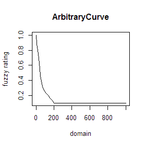
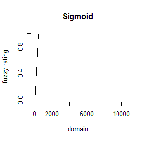
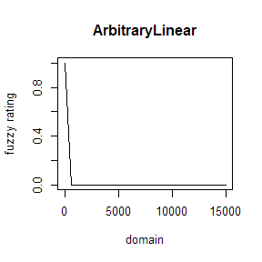
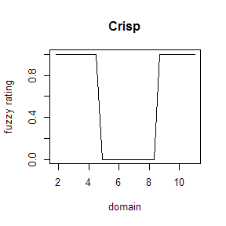
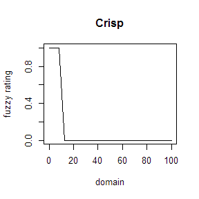

  


Extracting NASIS Rules/Evaluations
========================================


```r
library(soilDB)
library(RODBC)
library(XML)
library(plyr)
library(data.tree)
library(digest)


## TODO: finish evaluation parsing functions


# source local functions
source('local-functions.R')

# re-load cached data
# getAndCacheData()

# load cached data
load('cached-NASIS-data.Rda')

###
### evaluation curves
###

## TODO: someimes the property min/max values are crazy

## arbitrary curve: example: Storie Index C factor 
e <- evals[evals$evalname == '*Storie Factor C Slope 0 to 100%', ]
res <- extractEvalCurve(e)
s <- seq(e$propmin, e$propmax, length.out = 100)
plot(s, res(s), type='l', xlab='domain', ylab='fuzzy rating', main=e$evaluationtype)
```



```r
## sigmoid:
e <- evals[evals$evalname == 'SAR, <.5, 0-100cm (0 to 40")', ]
res <- extractEvalCurve(e)
s <- seq(e$propmin, e$propmax, length.out = 25)
plot(s, res(s), type='l', xlab='domain', ylab='fuzzy rating', main=e$evaluationtype)
```



```r
## arbitrary linear
e <- evals[evals$evalname == 'GRL - EC maximum in depth 25 to 50 cm (NV)', ]
res <- extractEvalCurve(e)
s <- seq(e$propmin, e$propmax, length.out = 25)
plot(s, res(s), type='l', xlab='domain', ylab='fuzzy rating', main=e$evaluationtype)
```



```r
## crisp:
e <- evals[evals$evalname == 'Soil pH (water) >= 4.5 and <= 8.4, 0-100cm', ]
res <- extractEvalCurve(e)
s <- seq(e$propmin, e$propmax, length.out = 25)
plot(s, res(s), type='l', xlab='domain', ylab='fuzzy rating', main=e$evaluationtype)
```



```r
e <- evals[evals$evalname == 'Available Water Capacity <10cm', ]
res <- extractEvalCurve(e)
s <- seq(e$propmin, e$propmax, length.out = 25)
plot(s, res(s), type='l', xlab='domain', ylab='fuzzy rating', main=e$evaluationtype)
```



```r
###
### Rules
###


# check a couple, RefId points to rows in rules or evaluation tables
# the dt$Do call links child sub-rules
# recursion is used to traverse to the deepest nodes, seems to work
# caution: don't run several times on the same object!

# increase limit argument to see the entire tree


## example
# just some random rule
y <- rules[rules$rulename == 'Dust PM10 and PM2.5 Generation', ]
dt <- parseRule(y)
# print intermediate results
print(dt, 'Type', 'Value', 'RefId', 'rule_refid', 'eval_refid', limit=25)
```

```
##                                   levelName     Type Value RefId rule_refid eval_refid
## 1 Dust PM10 and PM2.5 Generation                                                      
## 2  °--RuleHedge_de473ab5                    multiply   0.5                            
## 3      °--RuleOperator_0a397761              product                                  
## 4          ¦--Dryness Index 0.5 to 3                       18448                 18448
## 5          °--RuleOperator_7025ab26              sum                                  
## 6              ¦--Dust Due to Gypsum                       23659      23659           
## 7              °--Dust Due to Silt and Clay                23661      23661
```

```r
# recusively splice-in sub-rules
dt$Do(traversal='pre-order', fun=linkSubRules)
# splice-in evaluation functions, if possible
dt$Do(traversal='pre-order', fun=linkEvaluationFunctions)
print(dt, 'Type', 'Value', 'RefId', 'rule_refid', 'eval_refid', 'evalType', limit=25)
```

```
##                                                                        levelName           Type Value RefId rule_refid eval_refid evalType
## 1  Dust PM10 and PM2.5 Generation                                                                                                         
## 2   °--RuleHedge_de473ab5                                                              multiply   0.5                                     
## 3       °--RuleOperator_0a397761                                                        product                                           
## 4           ¦--Dryness Index 0.5 to 3                                                                 18448                 18448  Sigmoid
## 5           °--RuleOperator_7025ab26                                                        sum                                           
## 6               ¦--Dust Due to Gypsum                                                                 23659      23659                    
## 7               ¦   °--RuleHedge_5c18cb73                                          not_null_and     0                                     
## 8               ¦       °--Dust from Gypsum Content 2 to 15 Percent                                   18446                 18446  Sigmoid
## 9               °--Dust Due to Silt and Clay                                                          23661      23661                    
## 10                  °--RuleHedge_caf7e2e0                                        null_not_rated     0                                     
## 11                      °--Dust from Silt and Clay Content 20 to 70 Percent Sand                      18447                 18447   Linear
```

```r
## more examples
y <- rules[rules$rulename == 'AGR - California Revised Storie Index (CA)', ]
dt <- parseRule(y)
dt$Do(traversal='pre-order', fun=linkSubRules)
dt$Do(traversal='pre-order', fun=linkEvaluationFunctions)
print(dt, 'Type', 'Value', 'RefId', 'rule_refid', 'eval_refid', 'evalType', limit=25)
```

```
##                                                                              levelName         Type Value RefId rule_refid eval_refid       evalType
## 1  AGR - California Revised Storie Index (CA)                                                                                                       
## 2   °--RuleOperator_31a1eb65                                                                product                                                 
## 3       ¦--*Storie Factor A Not Rated Soil Orders rev                                                     49446      49446                          
## 4       ¦   °--RuleHedge_1193d3c1                                                           null_or     0                                           
## 5       ¦       °--*Storie Factor A Pedon Group not rated taxonomy rev                                    50481                 50481          ERROR
## 6       ¦--*Storie Factor A                                                                               15976      15976                          
## 7       ¦   °--RuleOperator_01948bb8                                                             or                                                 
## 8       ¦       ¦--*Storie Factor A Profile Group 1 rev                                                   49448      49448                          
## 9       ¦       ¦   °--RuleOperator_a72ba798                                                    and                                                 
## 10      ¦       ¦       ¦--RuleOperator_b267bf8e                                              times                                                 
## 11      ¦       ¦       ¦   ¦--*Storie Factor A Profile Group 1 and 2 fuzzy depth                         15967      15967                          
## 12      ¦       ¦       ¦   ¦   °--RuleHedge_7fad1a79                                  not_null_and     0                                           
## 13      ¦       ¦       ¦   ¦       °--*Storie Factor A Pedon Group 1 and 2 soil depth                    12916                 12916 ArbitraryCurve
## 14      ¦       ¦       ¦   °--*Storie Factor A Profile Group 1 taxonomy rev                              49447      49447                          
## 15      ¦       ¦       ¦       °--RuleOperator_4d1fdd8f                                         or                                                 
## 16      ¦       ¦       ¦           ¦--RuleHedge_44b2d8f3                              not_null_and     0                                           
## 17      ¦       ¦       ¦           ¦   °--*Storie Factor A Pedon Group 1 suborders                       12914                 12914          ERROR
## 18      ¦       ¦       ¦           ¦--RuleHedge_f2a5b4ba                              not_null_and     0                                           
## 19      ¦       ¦       ¦           ¦   °--*Storie Factor A Pedon Group 1 great groups                    12915                 12915          ERROR
## 20      ¦       ¦       ¦           °--RuleHedge_25e606a5                              not_null_and     0                                           
## 21      ¦       ¦       ¦               °--*Storie Factor A Pedon Group 1 subgroups                       13092                 13092          ERROR
## 22      ¦       ¦       °--RuleHedge_ea4b1839                                                   not     0                                           
## 23      ¦       ¦           °--*Storie Factor A Profile Group 7,8,9 landform                              15974      15974                          
## 24      ¦       ¦               °--RuleHedge_608f03c8                                  not_null_and     0                                           
## 25      ¦       ¦                   °--... 1 nodes w/ 0 sub                                                                                         
## 26      ¦       °--... 5 nodes w/ 78 sub                                                                                                            
## 27      °--... 5 nodes w/ 223 sub
```

```r
y <- rules[rules$rulename == 'Commodity Crop Productivity Index (Corn) (WI)', ]
dt <- parseRule(y)
dt$Do(traversal='pre-order', fun=linkSubRules)
dt$Do(traversal='pre-order', fun=linkEvaluationFunctions)
print(dt, 'Type', 'Value', 'RefId', 'rule_refid', 'eval_refid', 'evalType', limit=25)
```

```
##                                                           levelName         Type Value RefId rule_refid eval_refid       evalType
## 1  Commodity Crop Productivity Index (Corn) (WI)                                                                                 
## 2   °--WICCPI - Wisconsin Commodity Corn Production                                    54884      54884                          
## 3       °--RuleOperator_a065f114                                             sum                                                 
## 4           ¦--TNCCPI - OM Subrule                                                     35804      35804                          
## 5           ¦   °--RuleOperator_b2f2ecb9                                     sum                                                 
## 6           ¦       ¦--RuleHedge_e7500476                               multiply  0.07                                           
## 7           ¦       ¦   °--RuleHedge_2d1114bb                       not_null_and     0                                           
## 8           ¦       ¦       °--TNCCPI - OM 0-20cm                                      32564                 32564 ArbitraryCurve
## 9           ¦       °--RuleHedge_3bfe7036                               multiply 0.015                                           
## 10          ¦           °--RuleHedge_89ad8b80                       not_null_and     0                                           
## 11          ¦               °--TNCCPI - OM 20-100cm                                    32565                 32565 ArbitraryCurve
## 12          ¦--TNCCPI - CEC Subrule                                                    35806      35806                          
## 13          ¦   °--RuleOperator_c84408dd                                     sum                                                 
## 14          ¦       ¦--RuleHedge_2df3a135                               multiply  0.04                                           
## 15          ¦       ¦   °--RuleHedge_d9d4f738                       not_null_and     0                                           
## 16          ¦       ¦       °--TNCCPI - CEC 0-20cm or Restriction                      32566                 32566 ArbitraryCurve
## 17          ¦       °--RuleHedge_e41c4d9d                               multiply  0.02                                           
## 18          ¦           °--RuleHedge_8dcf6696                       not_null_and     0                                           
## 19          ¦               °--TNCCPI - CEC 20-100cm or Restriction                    32567                 32567 ArbitraryCurve
## 20          ¦--TNCCPI - pH 20-100cm  Subrule                                           35807      35807                          
## 21          ¦   °--RuleHedge_0f504f7b                                   multiply 0.015                                           
## 22          ¦       °--RuleHedge_fe8a1517                           not_null_and     0                                           
## 23          ¦           °--TNCCPI - pH 20-100cm                                        32568                 32568 ArbitraryCurve
## 24          ¦--TNCCPI - Depth to Restrictive feature                                   35811      35811                          
## 25          ¦   °--... 1 nodes w/ 2 sub                                                                                          
## 26          °--... 8 nodes w/ 40 sub
```

```r
y <- rules[rules$rulename == 'DHS - Catastrophic Mortality, Large Animal Disposal, Pit', ]
dt <- parseRule(y)
dt$Do(traversal='pre-order', fun=linkSubRules)
dt$Do(traversal='pre-order', fun=linkEvaluationFunctions)
print(dt, 'Type', 'Value', 'RefId', 'rule_refid', 'eval_refid', 'evalType', limit=25)
```

```
##                                                              levelName         Type Value RefId rule_refid eval_refid evalType
## 1  DHS - Catastrophic Mortality, Large Animal Disposal, Pit                                                                   
## 2   °--RuleOperator_b6496b7d                                                     or                                           
## 3       ¦--Permafrost                                                                       204        204                    
## 4       ¦   °--RuleOperator_dd37796c                                             or                                           
## 5       ¦       ¦--RuleHedge_ea3fa12b                                  not_null_and     0                                     
## 6       ¦       ¦   °--Permafrost (Consolidated) InLieuOf                                   167                   167    ERROR
## 7       ¦       ¦--RuleHedge_296e9a0c                                  not_null_and     0                                     
## 8       ¦       ¦   °--Texture Modifier (Permanently Frozen)                                351                   351    ERROR
## 9       ¦       °--RuleHedge_f6fc035d                                  not_null_and     0                                     
## 10      ¦           °--Shallow to Permafrost (50 to 100cm (20 to 40"))                    10356                 10356  Sigmoid
## 11      ¦--Ponded > 4 hours, Max                                                          19891      19891                    
## 12      ¦   °--RuleOperator_9fea508b                                            and                                           
## 13      ¦       ¦--RuleHedge_278a7dc1                                           not     0                                     
## 14      ¦       ¦   °--RuleHedge_1a7cc2f2                              not_null_and     0                                     
## 15      ¦       ¦       °--Ponding Frequency None, Max                                    16087                 16087    ERROR
## 16      ¦       °--RuleHedge_a68678bf                                  not_null_and     0                                     
## 17      ¦           °--Ponding Duration > Very Brief, Max                                 16088                 16088    ERROR
## 18      ¦--Flooding  Very Rare/Rare Freq.                                                 10909      10909                    
## 19      ¦   °--RuleOperator_1ead536d                                             or                                           
## 20      ¦       ¦--RuleHedge_4bc678de                                      multiply   0.4                                     
## 21      ¦       ¦   °--RuleHedge_82c14f91                              not_null_and     0                                     
## 22      ¦       ¦       °--Flooding "RARE"                                                  198                   198    ERROR
## 23      ¦       ¦--RuleHedge_5856520a                                      multiply   0.2                                     
## 24      ¦       ¦   °--RuleHedge_d9736f1f                              not_null_and     0                                     
## 25      ¦       ¦       °--... 1 nodes w/ 0 sub                                                                               
## 26      ¦       °--... 3 nodes w/ 4 sub                                                                                       
## 27      °--... 19 nodes w/ 129 sub
```

```r
# this one has a single RuleEvaluation: RefId points to rows in evals table
y <- rules[rules$rulename == 'Clay %, in surface - MO2', ]
dt <- parseRule(y)
dt$Do(traversal='pre-order', fun=linkSubRules)
dt$Do(traversal='pre-order', fun=linkEvaluationFunctions)
print(dt, 'Type', 'Value', 'RefId', 'rule_refid', 'eval_refid', 'evalType', limit=25)
```

```
##                                    levelName         Type Value RefId rule_refid eval_refid evalType
## 1 Clay %, in surface - MO2                                                    NA                    
## 2  °--RuleHedge_85c74e0f                     not_null_and     0               NA                    
## 3      °--Clay % >=40% at the surface, crisp                    11393         NA      11393    Crisp
```

```r
# check total number of nodes within data.tree object
dt$totalCount
```

```
## [1] 3
```
